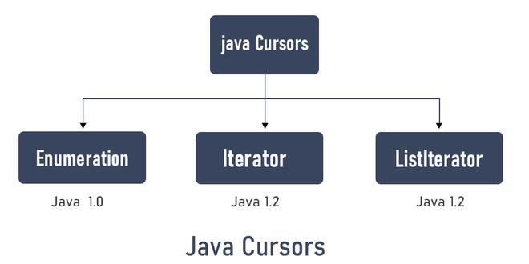

### Java Cursors


### ListIterator
1. It extends the iterator interface
2. It is useful for list implemented classes.
3. Available since java 1.2.
4. It supports bi-directional traversal. i.e both forward and backward directions.
5. It supports all the four CRUD operations(Create, Read, Update, Delete) operations.
   


#### ListIterator is a bi-directional iterator. For this functionality, it has two kinds of methods:


* Forward direction iteration

| Method    | Description|
|-----------|------------|
| hasNext() | This method returns true when the list has next element while iterating(based on cursor index).
| next()    | This method returns the next element of the list and advances the position of the cursor.
| nextIndex() | This method returns the next index value.


* Backward direction iteration

| Method          | Description|
|-----------------|------------|
| hasPrevious()   | This method returns true when the list has previous element while iterating(based on cursor index).
| previous()      | This method returns the previous element of the list and advances the position of the cursor.
| previousIndex() | This method returns the previous index value.

* Common Methods

| Method | Description                                                            |
|--------|------------------------------------------------------------------------|
| add    | This method inserts the specified element into the list.               |
| remove() | This method removes the current cursor pointed element from the list.  |
| set(Object) | This method replaces the current cursor pointed element from the list. |


### Advantages:
1. It supports all four CRUD (Create, Read, Update, Delete) operations.
2. It supports Bi-directional traversing i.e both forward and backward direction iteration.
3. Simple method names are easy to use.

### Limitations:
1. This iterator is only for list implementation classes.
2. Not a universal cursor.
3. It is not applicable to all collection API.
4. Parallel iteration of elements is not supported by the list Iterator.
5. listiterator does not support the good performance of numerous elements iteration.

### Similarities & Differences between Iterator & List Iterator
* They both are introduced in java 1.2.
* They both are used for iteration lists.
* They both support forward direction traversal.
* They both supports READ and DELETE operations.

| Iterator                                                                                                | List Iterator                                                                                                                              |
|---------------------------------------------------------------------------------------------------------|--------------------------------------------------------------------------------------------------------------------------------------------|
| It can traverse a collection of any type.                                                               | It traverses only list collection implemented classes like LinkedList, ArrayList, etc.                                                     |
| Traversal can only be done in forwarding direction.                                                     | Traversal of elements can be done in both forward and backward direction.                                                                  |
| ```  Iterator itr=list.iterator(); ```                                                                  | ``` ListIterator listIterator=departments.listIterator();```                                                                               |
| Deletion of elements is not allowed.                                                                    | Deletion of elements is allowed.                                                                                                           |
| Modification of any element is not allowed.                                                             | Modification is allowed.                                                                                                                   |
| It throws ConcurrentModificationException on doing addition operation. Hence, addiction is not allowed. | Addition of elements is allowed.                                                                                                           |
| In iterator, we can’t access the index of the traversed element.                                        | In listIterator, we have nextIndex() and previousIndex() methods for accessing the indexes of the traversed or the next traversing element. |
