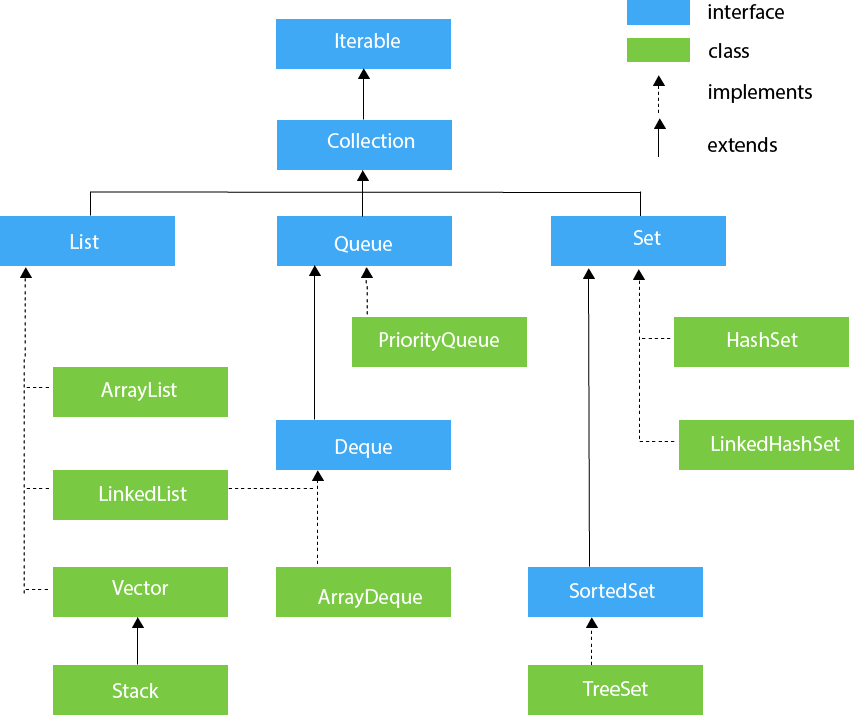

### Collections:
1. The Collection in Java is a framework that provides an architecture to store and manipulate the group of objects.
2. Java Collections can achieve all the operations that you perform on a data such as searching, sorting, insertion, manipulation, and deletion.
3. Java Collection means a single unit of objects. 
4. Java Collection framework provides many interfaces (Set, List, Queue, Deque) and classes (ArrayList, Vector, LinkedList, PriorityQueue, HashSet, LinkedHashSet, TreeSet).

